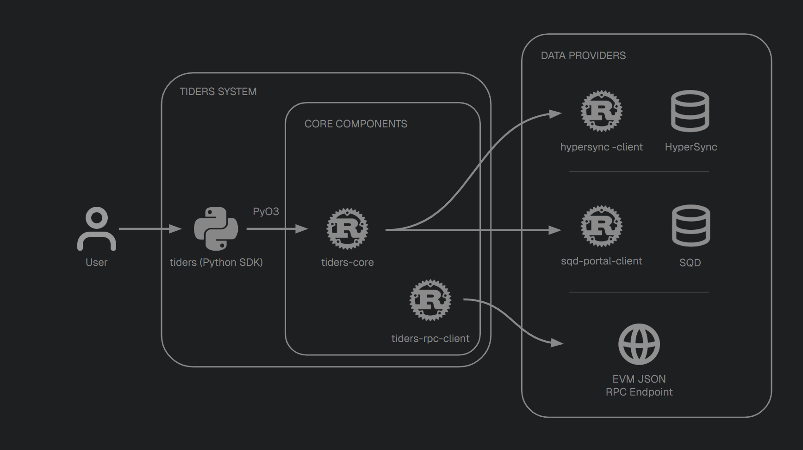

# Tiders Documentation

[](https://yulesa.github.io/tiders-docs/)
[](https://github.com/yulesa/tiders)
[](https://github.com/yulesa/tiders-core)
[](https://github.com/yulesa/tiders-rpc-client)

This repository contains the source for the [Tiders documentation site](https://yulesa.github.io/tiders-docs/).

Tiders is an open-source framework that simplifies getting data out of blockchains and into your favorite tools. Tiders is composed of some repositories. 3 owned ones. For more details, see the [main Tiders repository](https://github.com/yulesa/tiders).



## Building Locally

The docs are built with [mdBook](https://rust-lang.github.io/mdBook/).

### Install mdBook

```bash
cargo install mdbook
```

### Serve locally

```bash
cd tiders-docs
mdbook serve
```

This starts a local server at `http://localhost:3000` with live reload.

### Build

```bash
mdbook build
```

Output is written to the `site/` directory.

## Deployment

The site is automatically deployed to GitHub Pages via the [deploy workflow](.github/workflows/deploy.yml) on every push to `main`.

Updates in the other tiders repos don't update the auto-generated Rust API reference in this documentation.

## Structure

```
src/
├── SUMMARY.md              # Table of contents / sidebar
├── introduction.md         # Landing page
├── getting_started/        # Installation, quick start, first pipeline
├── tiders/                 # Python SDK docs (providers, query, steps, writers, CLI, examples)
├── tiders-core/            # Core Rust libraries (ingest, decode, cast, schemas)
├── tiders-rpc-client/      # RPC client (pipelines, configuration, querying)
├── api_reference.md        # Rust API reference
└── architecture.md         # Project architecture
```

## License

Licensed under either of

 * Apache License, Version 2.0
   ([LICENSE-APACHE](https://github.com/yulesa/tiders/blob/main/LICENSE-APACHE) or http://www.apache.org/licenses/LICENSE-2.0)
 * MIT license
   ([LICENSE-MIT](https://github.com/yulesa/tiders/blob/main/LICENSE-MIT) or http://opensource.org/licenses/MIT)

at your option.
