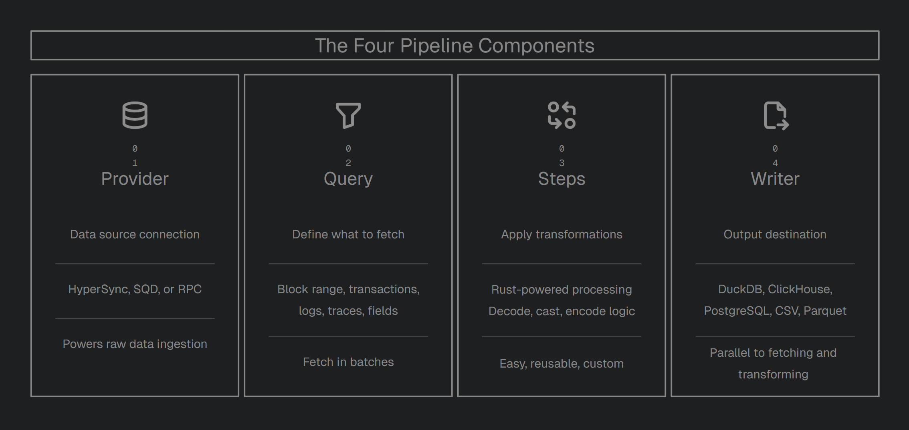

**Tiders** is an open-source framework that simplifies getting data out of blockchains and into your favorite tools. Whether you are building a DeFi dashboard, tracking NFT transfers, or running complex analytics, Tiders handles the heavy lifting of fetching, cleaning, transforming and storing blockchain data.

Tiders is modular. A Tiders pipeline is built from four components:

| Component | Description |
|---|---|
| `Provider` | Data source (HyperSync, SQD, or RPC) |
| `Query` | What data to fetch (block range, transaction, logs, filters, field selection) |
| `Steps` | Transformations to apply (decode, cast, encode, custom) |
| `Writer` | Output destination |

## Why Tiders?

Most indexers lock you into a specific platform or database. Tiders is built to be modular, meaning you can swap parts in and out without breaking your setup:

- **Swap Providers:** Don't like your current data source? Switch between HyperSync, SQD, or a standard RPC node by changing one line of code.
- **Plug-and-Play data transformations:** Need to decode smart contract events or change data types? Use our built-in Rust-powered steps or write your own custom logic.
- **Write Anywhere:** Send your data to a local DuckDB file for prototyping, or a production-grade ClickHouse or PostgreSQL instance when you're ready to scale.
- **Modular Reusable Pipelines:** Protocols often reuse the same data structures. You don't need write modules from scratch every time. Since Tiders pipelines are regular Python objects, you can build functions around them, reuse across pipelines, or set input parameters to customize as needed.

## Two ways to use Tiders

| Mode | How | When to use |
|---|---|---|
| **Python SDK** | Write a Python script, import `tiders` | Full control, custom logic, complex pipelines |
| **CLI (No-Code)** | Write a YAML config, run `tiders start` | Quick setup, no Python required, standard pipelines |

Both modes share the same pipeline engine.

You can also use `tiders codegen` to generate a Python script from a YAML config — a quick way to move from no-code to full Python control.

## Key Features

- **Continuous Ingestion:** Keep your datasets live and fresh. Tiders can poll the chain head to ensure your data is always up to date.
- **Switch Providers:** Move between HyperSync, SQD, or standard RPC nodes with a single config change.
- **No Vendor Lock-in:** Use the best data providers in the industry without being tied to their specific platforms or database formats.
- **Custom Logic:** Easily extend and customize your pipeline code in Python for complete flexibility.
- **Advanced Analytics:** Seamlessly works with industry-standard tools like Polars, Pandas, DataFusion and PyArrow as the data is fetched.
- **Multiple Outputs:** Send the same data to a local file and a production database simultaneously.
- **Rust-Powered Speed:** Core tasks like decoding and transforming data are handled in Rust, giving you massive performance without needing to learn a low-level language.
- **Parallel Execution:** Tiders doesn't wait around. While it's writing the last batch of data to your database, it's already fetching and processing the next one in the background.

## Data Providers

Connect to the best data sources in the industry without vendor lock-in. Tiders decouples the provider from the destination, giving you a consistent way to fetch data.

| Provider | Ethereum (EVM) | Solana (SVM) |
|---|---|---|
| [HyperSync](https://docs.envio.dev/docs/HyperSync/overview) | ✅ | ❌ |
| [SQD](https://docs.sqd.ai/) | ✅ | ✅ |
| RPC | ✅ | ❌ |

Tiders can support new providers. If your project has custom APIs to fetch blockchain data, especially ones that support server-side filtering, you can create a client for it, similar to the [Tiders RPC client](https://github.com/yulesa/tiders-rpc-client). Get in touch with us.

## Transformations

Leverage the tools you already know. Tiders automatically convert data batch-by-batch into your engine's native format, allowing for seamless, custom transformations on every incoming increment immediately before it is written.

| Engine | Data format in your function | Best for |
|---|---|---|
| **Polars** | `Dict[str, pl.DataFrame]` | Fast columnar operations, expressive API |
| **Pandas** | `Dict[str, pd.DataFrame]` | Familiar API, complex row-level operations |
| **DataFusion** | `Dict[str, datafusion.DataFrame]` | SQL-based transformations, lazy evaluation |
| **PyArrow** | `Dict[str, pa.Table]` | Zero-copy, direct Arrow manipulation |

## Supported Output Formats

Whether local or a production-grade data lake, Tiders handles the schema mapping and batch-loading to your destination of choice.

| Destination | Type | Description |
|---|---|---|
| **DuckDB** | Database | Embedded analytical database, great for local exploration and prototyping |
| **ClickHouse** | Database | Column-oriented database optimized for real-time analytical queries |
| **PostgreSQL** | Database | General-purpose relational database with broad ecosystem support |
| **Apache Iceberg** | Table Format | Open table format for large-scale analytics on data lakes |
| **Delta Lake** | Table Format | Storage layer with ACID transactions for data lakes |
| **Parquet** | File | Columnar file format, efficient for analytical workloads |
| **CSV** | File | Plain-text format, widely compatible and easy to inspect |

## Architecture

Tiders is composed of some repositories. 3 owned ones.

| Repository | Language | Role |
|---|---|---|
| [tiders](https://github.com/yulesa/tiders) | Python | User-facing SDK for building pipelines |
| [tiders-core](https://github.com/yulesa/tiders-core) | Rust | Core libraries for ingestion, decoding, casting, and schema |
| [tiders-rpc-client](https://github.com/yulesa/tiders-rpc-client) | Rust | RPC client for fetching data from any standard EVM JSON-RPC endpoint |

## API Reference

Auto-generated Rust API documentation is available at:

- [tiders-core rustdoc](./api/tiders_core/index.html)
- [tiders-rpc-client rustdoc](./api/tiders_rpc_client/index.html)
